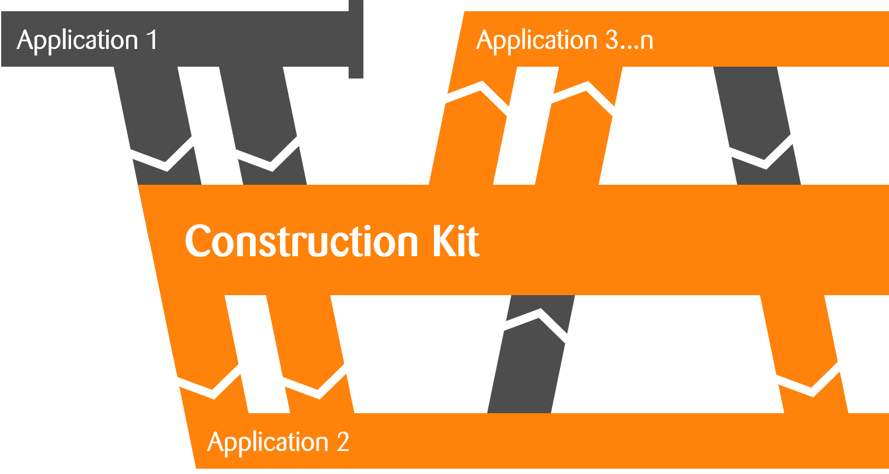

# {{page.title}}

One scenario we often encounter when advising a large company is the development of a bunch  of smaller or larger applications writen by employees for various purposes. Commonly these tools are spreadsheets stored in Microsoft Excel with a portion of business logic or databases created in Microsoft Access. Those application accumulate quite some knowledge and information that is essential for the business. The apparent ease with which such applications facilitate the work of the business units ("Let me just do this in Excel") ensures a rapid spread of these applications as "undercover projects" and thus presents the company with a broad set of challenges.

## The Challenge

On the part of the business units, business-critical data and information is handled uncontrollably and unnoticed by the companies' IT department. This entails risks not only in terms of data protection and availability of the application but also in terms of non-compliance. Both may have serious consequences for the company. In addition, the business unit staff spends a considerable amount of their time maintaining these applications instead of concentrating on their actual duties.

On the part of the company's IT departments, however, there is a need to curb this "uncontrolled growth". To ensure that this can be done efficiently in the eyes of both the employees and the company, it is important to ensure a standardized application landscape. This allows for new applications to be developed quickly and for existing applications to be maintained cheaply.

## A Bottom-Up Architecture Approach

A popular choice is to first develop a common framework. By decree this is then to be used as a foundation for all applications created henceforth. However, creating a framework is usually expensive and time-consuming without creating direct added value for the company's business. In addition, there is a high risk that the framework does not meet the actual requirements when the applications are eventually developed.

When facing such challenges, we usually guide our customers in a different direction:
Instead of creating a framework up front, we simply create the first of the new applications. This application not only delivers added value to the business right from the first release but acts as a nucleus for upcoming projects, too! We also call this first application the “incubator application”.

The development of the second application starts with generalizing components from the incubator into an “architectural construction kit”. This includes the application skeleton with a basic UI layout, navigation structure and authentication and authorization capabilities.

As the family of applications built using our construction kit grows, so does the construction kit. While more and more components are shared between applications, it is important to provide the reusable artifacts in an appropriate and easily accessible form together with comprehensive documentation.
This approach enables effective and efficient development, since the developers do not have to complete recurring standard tasks repeatedly with each project. On the other hand, it increases the quality of the software in the long run, since defects that have been fixed in the construction kit remove the issue from all affected applications.

## Money for Nothin’ and Change for Free?

Although this approach is certainly cost-effective, it does not come for free. Both the construction kit and the developers’ mindset need active maintenance. Otherwise, the once flexible construction kit will become stale and turn into yet another framework rather quickly.

Usually, the construction kit maintenance will be carried out as part of the ongoing application development. But as the number of applications and developers grows, it is essential to have an experienced developer acting as what we like to call a “free electron”. This developer should have both the time and budget to enable communication and know-how-transfer between project teams. This ensures that synergies between the projects are reliably recognized and utilized, and that differences in the know-how of developers can be balanced by suitable measures. A question we usually get in this context is who is going to pay for the free electron. In our experience it is important to fund this role in a way that does not strain the projects' budgets. This mitigates the risk of projects missing out on using the construction kit due to financial concerns. It also ensures that maintenance of the construction kit is not being rationalized away because of being seeminly just a cost factor with no added value.

## Conclusion

Using a bottom-up architecture approach has many advantages over a top-down one. Apart from delivering additional value to the business right from the beginning, it comes with a high return on invest: Projects will start faster with fewer problems. Due to a common set of components and common standards, developers will gain speed more quickly. Re-use becomes a reality and not a nightmare.
Try it for yourself: If you start to think about developing a framework, start with a real application instead – your framework will emerge over time when needed!

*By {{page.authorName}}*